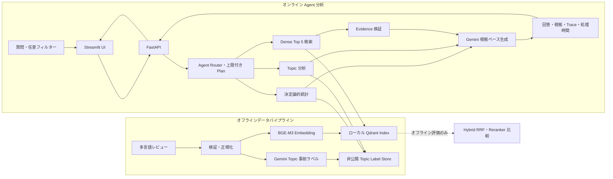

# Aladdin — Tokyo Disney Review Intelligence

[English](README.md) | [日本語](README.ja.md)

Aladdin は、東京ディズニーランドのカスタマーレビューを分析する、多言語・根拠提示型の RAG アシスタントです。マネージャーは自由形式の質問を入力し、市場・日付・評価で絞り込みながら、回答の根拠となった原文レビューを確認できます。

## プロダクトデモ


このデモでは、日本語による市場比較質問、Agent の自動 Routing・Filter、監査可能な Tool Trace、全件 Topic 分析、根拠に基づく回答生成、参照レビューの展開を確認できます。

本プロジェクトは、再現可能なデータ処理、人手評価で選定した Dense 検索、比較実験用の Hybrid / Reranker、根拠に基づく回答生成、回帰評価、可観測性、業務向け UI を含む、Applied AI のエンドツーエンド実装です。

## 主な機能

- 英語・日本語・中国語などの自由形式質問に対応
- 2,049 件のレビューを市場、日付、評価で絞り込み
- 質問を根拠付き Q&A、Root-Cause、Market Comparison、Improvement Planning に自動分類
- 全 2,049 件の AI 支援ラベルから市場・Topic・Sentiment を決定論的に集計
- 対話処理では、人手評価で選定した BGE-M3 Dense Top 5 を使用
- Sparse / RRF と `BAAI/bge-reranker-v2-m3` は再現可能なオフライン比較用として保持
- Gemini による、レビュー ID を引用した根拠ベースの回答生成
- 原文、翻訳、評価、投稿日を確認できる展開式エビデンスカード
- Gemini 障害時も検索済みエビデンスを返す Graceful Degradation
- 検索、リランキング、生成、全体処理時間のトレース
- English / 日本語を切り替えられる Streamlit UI

## アーキテクチャ



コンポーネントの責務、障害時の挙動、設計判断は [docs/architecture.md](docs/architecture.md) を参照してください。

## データセット

| 市場 | レビュー数 |
|---|---:|
| 中国本土（`CN`） | 1,175 |
| 香港（`HK`） | 440 |
| 韓国（`KR`） | 434 |
| **合計** | **2,049** |

対象期間は 2023-06-07 から 2026-02-11、評価は 1～5 です。レビュー投稿者のプライバシーおよびソースプラットフォームの再配布条件を尊重するため、レビュー原文、ユーザー名、候補プール、翻訳キャッシュ、Qdrant データベースは公開リポジトリに含めていません。集計値、評価方法、レビュー本文を含まない人手関連度ラベルは公開しています。

データ出典：Trip.com/Ctrip.com の中国本土・韓国・香港の実購入者レビュー。

## クイックスタート

必要環境：Python 3.12、および BGE-M3 と BGE Reranker を読み込めるメモリ。

```bash
python3.12 -m venv .venv
source .venv/bin/activate
pip install -r requirements.txt
cp .env.example .env
```

`.env` に `GEMINI_API_KEY` と `GEMINI_MODEL` を設定します。完全な Index を再構築するには、権限のあるデータソースが必要です。非公開データの境界は [data/README.md](data/README.md) を参照してください。

```bash
make validate-data
make rebuild-index
```

API と UI を別々のターミナルで起動します。

```bash
make run-api
make run-ui
```

両方のサービスをローカルで起動した後、自分のブラウザで以下のアドレスを開きます。これらはローカル開発用 Endpoint であり、公開 Demo のリンクではありません。

- UI: `http://127.0.0.1:8501`
- API Docs: `http://127.0.0.1:8000/docs`
- Health Check: `http://127.0.0.1:8000/health`

Docker を利用する場合：

```bash
docker compose up --build
```

初回起動時は Embedding / Reranker モデルの取得に数分かかる場合があります。

### 面接用の制御付き一時公開

任意の `interview` Compose Profile は API を localhost に限定したまま、一時的な Cloudflare Quick Tunnel を追加します。`.env` に強力な `ALADDIN_DEMO_PASSWORD`、別の `ALADDIN_API_TOKEN`、Request / Generation 上限を設定して実行します。

```bash
make demo-up
# 面接終了後
make demo-down
```

Tunnel Log に表示される一時的な `trycloudflare.com` URL は停止後に無効になります。これはローカル実行 Application への制御付き外部アクセスであり、恒久的な Cloud Deployment ではありません。安全確認と外部回線 Test は [docs/interview-demo.md](docs/interview-demo.md) を参照してください。

## API

`GET /api/v1/metadata` は、市場や日付などのフィルター候補とレビュー件数を返します。

`POST /api/v1/analyze` は自由形式質問とフィルターを受け取ります。

```json
{
  "query": "低評価レビューに多い不満は何ですか？",
  "regions": ["CN", "KR"],
  "min_rating": 1,
  "max_rating": 3,
  "date_from": "2024-01-01",
  "date_to": "2025-12-31",
  "top_k": 5
}
```

`POST /api/v1/retrieve` は Gemini を呼ばずに検索のみを実行します。`mode` は `dense`、`hybrid`、`hybrid_rerank` に対応し、`candidate_limit` で候補プールのサイズを制御できます。

### AI 支援トピックラベル

本 Project には、Version 管理された日英対応のトピック分類体系と、途中から再開できる Gemini 事前ラベル付け Pipeline が含まれます。各 Review に複数トピック、全体 Sentiment、Confidence を付与し、Agent が市場・評価・日付別のトピック分布を決定論的に集計します。

```bash
# まず小規模 Sample で API 使用量を確認
python scripts/build_topic_labels.py --limit 40 --batch-size 20

# 市場および低・高評価を均等に含む QA Sample
python scripts/build_topic_labels.py --limit 60 --sample-strategy balanced

# 後日再開（完了済み review_id は自動的に Skip）
make topic-labels
```

`data/topic_labels.jsonl` は非公開の派生 Data であり、Review 原文と同様に Git から除外されます。AI 支援ラベルは Ground Truth ではありません。本番利用では Sampling、人手修正、Taxonomy の Version 管理、品質測定が必要です。

v1.1 では全 2,049 件をラベル付けしました。低 Confidence および評価と Sentiment の不一致候補を意図的に多く含む 90 件を人手監査し、81 件を確認、9 件を Skip しました。確認済み Sample に対して、Topic 完全一致率は **93.8%**、Multi-label Micro-F1 は **98.2%**、Sentiment 正解率は **91.4%** でした。単純無作為抽出による母集団推定ではなく、Support の少ない Topic の結果は一般化できません。`make evaluate-topic-labels` でローカル再計算できます。

## テストと評価

Unit Test：

```bash
make test
```

20 問の回帰スイートでは、API 契約、フィルター、エビデンス数、引用、障害時の縮退動作、多言語実行を確認します。

```bash
make regression
```

完全な回帰テストは Gemini を呼び出すため、API 使用料が発生する可能性があります。

別の Agent 評価 Suite には、Task Routing、市場推論、苦情・低評価 Intent、明示 Filter 優先、Tool Plan、決定論的統計、Citation、Evidence なし、Provider 障害 Contract を扱う **英語・日本語・中国語 40 問**があります。構造評価は Gemini を呼ばず無料で実行できます。

```bash
make agent-eval
```

必要な場合のみ、ローカル Agent API に対して End-to-End 評価を実行します。

```bash
make agent-eval-live
```

Live 評価は Gemini を呼ぶ可能性があり、設定した1日あたりの Generation 上限で保護されます。Provider 障害は実際の障害を起こさず、Unit Test の決定論的 Fake で検証します。

## 人手評価済み検索結果

15 問、241 件の Query / Review ペアに対して、0（無関係）、1（部分的に関連）、2（直接関連）の人手ラベルを作成しました。

対話型 API は **Dense Top 5** を使用します。5 件のエビデンスを Gemini に渡す実際の条件で、Recall@5 と nDCG@5 がともに最高だったためです。

| 検索方式 | Recall@5 | nDCG@5 | 平均処理時間 |
|---|---:|---:|---:|
| **Dense（対話型デフォルト）** | **0.365** | **0.772** | **387 ms** |
| Hybrid RRF | 0.314 | 0.707 | 243 ms |
| Hybrid + Reranker（候補 10 件） | 0.344 | 0.758 | 3,467 ms |
| Hybrid + Reranker（候補 20 件） | 0.335 | 0.744 | 6,834 ms |

以下の Top 10 結果は、より広い検索比較のために保持しています。

| 検索方式 | Recall@10 | nDCG@10 | 平均処理時間 |
|---|---:|---:|---:|
| Dense | 0.673 | 0.792 | 410 ms |
| Hybrid RRF | 0.616 | 0.732 | 222 ms |
| Hybrid + Reranker（候補 10 件） | 0.607 | 0.745 | 3,301 ms |
| Hybrid + Reranker（候補 20 件） | **0.674** | **0.800** | 6,163 ms |

Top 5 では Dense が Recall とランキング品質の両方で最高でした。Top 10 では候補 20 件の Reranker がわずかに上回りましたが、CPU 上で数秒の遅延が追加されます。そのため Dense を対話型処理のデフォルトとし、Hybrid / Reranker は評価 API で比較可能な状態を維持しています。

詳細は [docs/retrieval-baseline.md](docs/retrieval-baseline.md) を参照してください。

## 信頼性と可観測性

- フィルターに一致するレビューがない場合、Gemini を呼ばず回答生成をスキップ
- Gemini 障害時も取得済みレビューを表示し、`degraded` ステータスを返却
- Gemini の Primary Model が一時的に過負荷の場合、設定済みの Fallback Model で回答生成と翻訳を再試行
- 回答の引用 ID が返却エビデンスに含まれることを回帰テストで確認

## Review Intelligence Agent

既存 RAG API の互換性を保ちながら、評価済みの検索基盤を
Tool-Using Analytics Agent に拡張しました。

新しい `POST /api/v1/agent/analyze` は、質問を次の Task に振り分けます。

- 根拠付き Q&A
- Complaint Root-Cause Analysis
- Market Comparison
- Improvement Priority Planning

Agent は、決定論的な Review Statistics、全件 Topic Distribution、
Market Comparison、Dense Retrieval、Evidence Verification、Grounded
Generation を順番に実行し、Task、Filter、Tool
Output、Evidence、実行 Step、処理時間、最終回答を返します。件数・平均値は
Code で計算し、Gemini に数値を推測させません。Root-Cause / Improvement
Task は、Rating 条件が指定されない場合に 1～3 Star を対象とします。

英語・日本語・中国語の質問から市場名と Complaint / Low-Rating Intent を
自動抽出し、UI Filter が未指定の場合に適用します。現段階では安全で評価可能な
固定上限付き Plan を採用し、会話 Memory、Replanning、より広い Agent Task
Completion Evaluation は次の Milestone です。
- API ログは JSON Lines 形式で Request ID、Method、Path、Status、処理時間を記録
- `X-Request-ID` レスポンスヘッダーでログを追跡可能
- データ検証と決定論的 Qdrant Point ID による再現性
- AI 提案ラベルと人手確認ラベルを明確に分離

## 現在の制約

- 評価対象は 15 問であり、より強い一般化主張には 30～50 問と信頼区間が必要
- ローカル Embedded Qdrant は単一プロセス所有であり、本番用の分散構成ではない
- ローカル CPU 上の Reranker は対話型用途には遅い
- 認証、認可、テナント分離、監視 Dashboard、Cloud 公開は未実装

## 今後のロードマップ

1. 評価質問を 30～50 問に拡張
2. Bootstrap 信頼区間と Latency Percentile を追加
3. Evidence Threshold と回答不能判定を調整
4. Docker 化した Application を Cloud に公開

## リポジトリ構成

```text
app/                    FastAPI Schema・Service
data/                   非公開データ境界の説明
docs/                   Architecture・評価・Case Study
evals/                  回帰質問と関連度ラベル
scripts/                評価・Annotation Script
src/                    Data Preparation・Index Build
tests/                  Automated Test
demo_v2.py              English / 日本語 Streamlit UI
Makefile                再現可能な開発コマンド
```

## ライセンス

Source Code は [MIT License](LICENSE) で公開しています。レビュー原文およびソースプラットフォームのデータは本ライセンスの対象外です。
