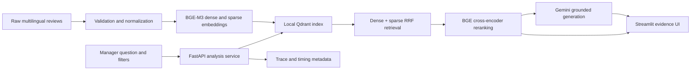

# Aladdin — Tokyo Disney Review Intelligence

Aladdin is an evidence-grounded, multilingual review analysis assistant for Tokyo Disneyland. It lets managers ask open-ended business questions, apply market/date/rating filters, and inspect the original customer reviews behind every answer.

The project demonstrates an end-to-end applied AI workflow: reproducible data ingestion, hybrid retrieval, cross-encoder reranking, grounded generation, regression evaluation, observability, and a business-facing UI.

## What it can do

- Answer free-form questions in English or Chinese instead of relying on predefined prompts.
- Filter 2,049 reviews by one or more markets, date range, and rating range.
- Combine BGE-M3 dense and sparse retrieval with Reciprocal Rank Fusion (RRF).
- Rerank candidates using `BAAI/bge-reranker-v2-m3`.
- Generate evidence-based answers with review ID citations.
- Show expandable evidence cards with original text and English translations.
- Degrade gracefully when Gemini is unavailable while preserving retrieved evidence.
- Report retrieval, reranking, generation, and end-to-end timing.

## Architecture



See [docs/architecture.md](docs/architecture.md) for component responsibilities, failure behavior, and design decisions.

## Dataset

The indexed dataset currently contains:

| Market | Reviews |
|---|---:|
| China (`CN`) | 1,175 |
| Hong Kong (`HK`) | 440 |
| Korea (`KR`) | 434 |
| **Total** | **2,049** |

Review dates range from 2023-06-07 to 2026-02-11. Ratings range from 1 to 5. The source and normalized JSONL files are versioned; the generated Qdrant database is not.

## Quick start

Requirements: Python 3.12 and sufficient memory to load BGE-M3 and the BGE reranker.

```bash
python3.12 -m venv .venv
source .venv/bin/activate
pip install -r requirements.txt
cp .env.example .env
```

Set `GEMINI_API_KEY` and `GEMINI_MODEL` in `.env`.

If `data/qdrant_db` is not present, build the local index:

```bash
make validate-data
make rebuild-index
```

`make rebuild-index` intentionally replaces `data/qdrant_db`; stop the API before running it. The underlying Python command refuses to replace an index unless `--yes` is supplied.

Start the services in separate terminals:

```bash
make run-api
make run-ui
```

Open:

- UI: <http://127.0.0.1:8501>
- API documentation: <http://127.0.0.1:8000/docs>
- Health check: <http://127.0.0.1:8000/health>

## API

`GET /api/v1/metadata` returns data-driven filter options and counts.

`POST /api/v1/analyze` accepts:

```json
{
  "query": "What do visitors say about food prices?",
  "regions": ["CN", "KR"],
  "min_rating": 1,
  "max_rating": 4,
  "date_from": "2024-01-01",
  "date_to": "2025-12-31",
  "top_k": 5
}
```

All filters are optional. An empty `regions` list searches every market.

## Data pipeline

Validate the raw data without writing files:

```bash
make validate-data
```

Normalize the source JSONL atomically:

```bash
make prepare-data
```

Rebuild the complete dense+sparse Qdrant index:

```bash
make rebuild-index
```

The pipeline checks JSON validity, required IDs/text, duplicate IDs, rating bounds, locale mapping, and ISO dates. Point IDs are deterministic UUIDs, so the same review receives the same Qdrant identity on every rebuild.

## Tests and regression suite

Run unit tests:

```bash
make test
```

The initial regression suite contains 20 fixed questions covering topic summaries, new/open topics, positive and negative reviews, market filters, date/rating filters, Chinese/English queries, and no-evidence behavior.

Run one inexpensive no-evidence smoke case:

```bash
python scripts/run_regression.py --case-id no_results_future_en
```

Run all cases against the local API:

```bash
make regression
```

Full runs call the configured Gemini model and may incur cost. Reports are written to `evals/results/latest.json` and are intentionally excluded from Git.

## Retrieval trace

Every response records:

- embedding, retrieval, reranking, generation, and total latency;
- candidate and selected evidence counts;
- RRF rank versus reranker rank;
- selected review IDs and applied filters;
- generation status (`completed`, `degraded`, or `skipped_no_evidence`).

## Current limitations

- The Qdrant database is local and supports one process at a time.
- Translation is currently generated on demand and is not cached persistently.
- Evidence sufficiency is prompt-guided; a calibrated reranker threshold is planned.
- The regression suite validates contracts and filter correctness but still needs human relevance labels for Recall@K/MRR comparison.
- The application has no authentication or multi-tenant isolation yet.

## Roadmap

1. Label retrieval relevance for 30–50 evaluation questions.
2. Compare dense-only, hybrid RRF, and hybrid + reranker pipelines.
3. Calibrate evidence thresholds and unsupported-question behavior.
4. Add structured request logging, persistent translation caching, and Docker deployment.

## Repository structure

```text
app/                    FastAPI schemas and services
data/                   Source and normalized review JSONL
docs/                   Architecture and design notes
evals/                  Fixed regression cases
scripts/                Regression runner
src/                    Data preparation and index-building tools
tests/                  Automated unit tests
demo_v2.py              Streamlit management UI
Makefile                Reproducible developer commands
```
