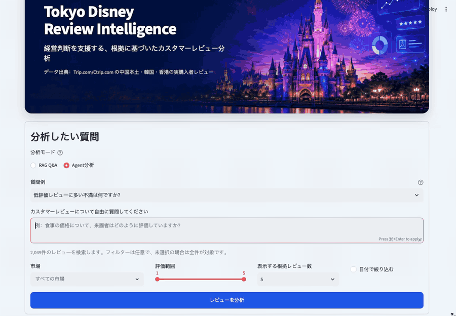
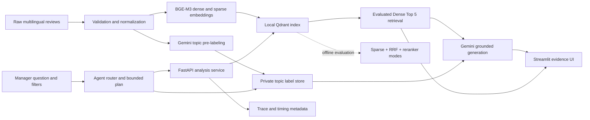

# Aladdin — Tokyo Disney Review Intelligence

[English](README.md) | [日本語](README.ja.md)

Aladdin is an evidence-grounded, multilingual review analysis assistant for Tokyo Disneyland. It lets managers ask open-ended business questions, apply market/date/rating filters, and inspect the original customer reviews behind every answer.

## Product demo



The demo shows a Japanese market-comparison question, automatic Agent routing and filtering, an auditable tool trace, full-dataset topic analytics, grounded generation, and expandable source reviews.

The project demonstrates an end-to-end applied AI workflow: reproducible data ingestion, evaluation-selected dense retrieval, experimental hybrid/reranker modes, grounded generation, regression evaluation, observability, and a business-facing UI.

## What it can do

- Answer free-form questions in English, Japanese, or Chinese instead of relying on predefined prompts.
- Filter 2,049 reviews by one or more markets, date range, and rating range.
- Route questions into evidence Q&A, root-cause analysis, market comparison, or improvement planning.
- Calculate market/topic/sentiment statistics from all 2,049 AI-assisted labels rather than asking Gemini to estimate counts.
- Use BGE-M3 Dense Top 5 in the interactive path, selected through human-labeled evaluation.
- Retain sparse/RRF and `BAAI/bge-reranker-v2-m3` modes for reproducible offline comparison.
- Generate evidence-based answers with review ID citations.
- Show expandable evidence cards with original text and English translations.
- Degrade gracefully when Gemini is unavailable while preserving retrieved evidence.
- Report retrieval, reranking, generation, and end-to-end timing.

## Architecture



See [docs/architecture.md](docs/architecture.md) for component responsibilities, failure behavior, and design decisions.

## Dataset

The indexed dataset currently contains:

| Market | Reviews |
|---|---:|
| China (`CN`) | 1,175 |
| Hong Kong (`HK`) | 440 |
| Korea (`KR`) | 434 |
| **Total** | **2,049** |

Review dates range from 2023-06-07 to 2026-02-11. Ratings range from 1 to 5. To respect reviewer privacy and source-platform redistribution restrictions, raw review text, usernames, generated candidate pools, translations, and the Qdrant database are not included in this public repository. The aggregate counts and human-verified relevance grades are retained for reproducibility of the documented evaluation methodology.

## Quick start

Requirements: Python 3.12 and sufficient memory to load BGE-M3 and the BGE reranker.

```bash
python3.12 -m venv .venv
source .venv/bin/activate
pip install -r requirements.txt
cp .env.example .env
```

Set `GEMINI_API_KEY` and `GEMINI_MODEL` in `.env`.

If `data/qdrant_db` is not present, build the local index:

```bash
make validate-data
make rebuild-index
```

The private source files expected by the pipeline are documented in [data/README.md](data/README.md). They must be obtained through an authorized source before rebuilding the full index.

`make rebuild-index` intentionally replaces `data/qdrant_db`; stop the API before running it. The underlying Python command refuses to replace an index unless `--yes` is supplied.

Start the services in separate terminals:

```bash
make run-api
make run-ui
```

After both services are running locally, open the following addresses in your own browser. These are local development endpoints, not publicly hosted demo links:

- UI: `http://127.0.0.1:8501`
- API documentation: `http://127.0.0.1:8000/docs`
- Health check: `http://127.0.0.1:8000/health`

### Docker Compose

After preparing `.env` and building `data/qdrant_db`, start both services with:

```bash
docker compose up --build
```

The API owns the embedded Qdrant directory; the UI reaches it through the internal Compose network. The first start can take several minutes while embedding and reranker models are downloaded into the shared model cache.

## API

`GET /api/v1/metadata` returns data-driven filter options and counts.

`POST /api/v1/analyze` accepts:

```json
{
  "query": "What do visitors say about food prices?",
  "regions": ["CN", "KR"],
  "min_rating": 1,
  "max_rating": 4,
  "date_from": "2024-01-01",
  "date_to": "2025-12-31",
  "top_k": 5
}
```

All filters are optional. An empty `regions` list searches every market.

`POST /api/v1/retrieve` runs retrieval without calling Gemini. Set `mode` to `dense`, `hybrid`, or `hybrid_rerank`; `candidate_limit` controls the hybrid/reranker candidate pool. This endpoint powers reproducible quality and latency experiments.

## Data pipeline

Validate the raw data without writing files:

```bash
make validate-data
```

Normalize the source JSONL atomically:

```bash
make prepare-data
```

Rebuild the complete dense+sparse Qdrant index:

```bash
make rebuild-index
```

The pipeline checks JSON validity, required IDs/text, duplicate IDs, rating bounds, locale mapping, and ISO dates. Point IDs are deterministic UUIDs, so the same review receives the same Qdrant identity on every rebuild.

### AI-assisted topic labels

The project includes a versioned, multilingual topic taxonomy and a resumable Gemini pre-labeling pipeline. It assigns multiple topics, overall sentiment, and a confidence score to each review, then lets the Agent calculate topic distributions by market, rating, and date.

```bash
# Start with a small, inexpensive sample
python scripts/build_topic_labels.py --limit 40 --batch-size 20

# Representative QA sample across markets and low/high ratings
python scripts/build_topic_labels.py --limit 60 --sample-strategy balanced

# Resume later; completed review IDs are skipped automatically
make topic-labels
```

`data/topic_labels.jsonl` is private derived data and is excluded from Git together with the review text. AI-assisted labels are not ground truth: production use requires sampling, human correction, taxonomy versioning, and quality measurement before business decisions are automated.

The completed v1.1 run labeled all 2,049 reviews. A 90-item human audit intentionally oversampled low-confidence outputs and rating/sentiment tensions: 81 items were verified and 9 skipped. Against the verified items, topic exact match was **93.8%**, multilabel micro-F1 was **98.2%**, and sentiment accuracy was **91.4%**. These are audit-sample results, not estimates from a simple random sample; low-support per-topic results should not be generalized. Recalculate locally with `make evaluate-topic-labels`.

## Tests and regression suite

Run unit tests:

```bash
make test
```

The initial regression suite contains 20 fixed questions covering topic summaries, new/open topics, positive and negative reviews, market filters, date/rating filters, Chinese/English queries, and no-evidence behavior.

Run one inexpensive no-evidence smoke case:

```bash
python scripts/run_regression.py --case-id no_results_future_en
```

Run all cases against the local API:

```bash
make regression
```

Full runs call the configured Gemini model and may incur cost. Reports are written to `evals/results/latest.json` and are intentionally excluded from Git.

Generate a pooled relevance-labeling file and compare all retrieval modes:

```bash
make annotation-pool
make run-annotation
# open http://127.0.0.1:8502 and assign relevance grades 0, 1, or 2
make evaluate-retrieval
```

The human-verified retrieval comparison is documented in [docs/retrieval-baseline.md](docs/retrieval-baseline.md): 241 judgments across 15 questions compare dense, hybrid RRF, and two reranker candidate-pool sizes.

The internal benchmark contains 241 unique candidates across 15 questions. Candidate text and cached translations are excluded from the public repository; the annotation workflow and human-verified relevance grades remain available for inspection. AI translations and suggestions are explicitly separated from human-verified labels.

### Human-verified retrieval results

The production endpoint uses **Dense Top 5**, selected from the same 241 human judgments because it achieved the best Recall@5 and nDCG@5 while remaining interactive.

| Retrieval mode | Recall@5 | nDCG@5 | Mean latency |
|---|---:|---:|---:|
| **Dense (production default)** | **0.365** | **0.772** | **387 ms** |
| Hybrid RRF | 0.314 | 0.707 | 243 ms |
| Hybrid + reranker (10 candidates) | 0.344 | 0.758 | 3,467 ms |
| Hybrid + reranker (20 candidates) | 0.335 | 0.744 | 6,834 ms |

The broader Top-10 comparison remains useful for retrieval experiments:

| Retrieval mode | Recall@10 | nDCG@10 | Mean latency |
|---|---:|---:|---:|
| Dense | 0.673 | 0.792 | 410 ms |
| Hybrid RRF | 0.616 | 0.732 | 222 ms |
| Hybrid + reranker (10 candidates) | 0.607 | 0.745 | 3,301 ms |
| Hybrid + reranker (20 candidates) | **0.674** | **0.800** | 6,163 ms |

At Top 5, dense retrieval had the strongest recall and ranking quality. At Top 10, the 20-candidate reranker was only marginally better while adding several seconds of CPU latency. Dense retrieval is therefore the measured interactive default; hybrid and reranker modes remain available through the evaluation endpoint for reproducible comparison.

## Demonstrable product behavior

- **Open-ended analysis:** a manager can ask about queues, staff, food, price, children, sentiment, or a new topic without adding a hard-coded question.
- **Auditable answers:** each summary is paired with the exact review IDs, original text, market, rating, and date used as evidence.
- **Dynamic segmentation:** the same question can be rerun for selected markets, rating ranges, date ranges, and evidence counts.
- **Graceful degradation:** if Gemini is unavailable, the API returns a clear degraded status and still displays retrieved customer evidence instead of failing the whole workflow.
- **Model fallback:** if the primary Gemini model is temporarily overloaded, answer generation and evidence translation retry with the configured fallback model.
- **Measured trade-offs:** retrieval choices are justified using human labels rather than a purely qualitative demo.

## Review Intelligence Agent

The evaluated RAG system now includes a bounded, tool-using analytics Agent
while keeping `/api/v1/analyze` compatible.

The Agent endpoint is:

```http
POST /api/v1/agent/analyze
```

It routes a request into one of four auditable task types:

- evidence-grounded Q&A;
- complaint root-cause analysis;
- market comparison;
- improvement-priority planning.

The Agent can call deterministic review statistics, full-dataset topic
distribution and market-comparison tools, evaluated Dense retrieval, evidence
verification, and grounded generation. Its response includes the
selected task, filters, tool outputs, evidence, execution steps, timing, and
final answer. Counts and averages are calculated in code; Gemini is not allowed
to invent quantitative findings. Root-cause and improvement tasks default to
reviews rated 1–3 unless the caller supplies a rating range.

Example:

```bash
curl -X POST http://127.0.0.1:8000/api/v1/agent/analyze \
  -H 'Content-Type: application/json' \
  -d '{
    "query": "Compare queue complaints from Korean and Hong Kong visitors",
    "regions": ["KR", "HK"],
    "evidence_limit": 5
  }'
```

The Agent automatically infers referenced markets and complaint/low-rating
intent from English, Japanese, and Chinese questions when explicit UI filters
are absent. Plans remain intentionally bounded and auditable rather than an
open-ended autonomous loop. Conversation memory, replanning, and broader Agent
task-completion evaluation remain future milestones.

See [docs/portfolio-case-study.md](docs/portfolio-case-study.md) for the interview narrative and [docs/demo-script.md](docs/demo-script.md) for a short recording script.

## Retrieval trace

Every response records:

- embedding, retrieval, reranking, generation, and total latency;
- candidate and selected evidence counts;
- RRF rank versus reranker rank;
- selected review IDs and applied filters;
- generation status (`completed`, `degraded`, or `skipped_no_evidence`).

API access logs are emitted as JSON lines with request ID, method, path, status code, and duration. The same request ID is returned in the `X-Request-ID` response header for troubleshooting.

## Current limitations

- The Qdrant database is local and supports one process at a time.
- User-facing answer translation is generated on demand; annotation translations are cached locally to avoid repeated Gemini usage.
- Evidence sufficiency is prompt-guided; a calibrated reranker threshold is planned.
- The retrieval benchmark currently covers 15 questions and 241 human-verified query/review pairs; broader domain coverage and confidence intervals are still needed.
- The application has no authentication or multi-tenant isolation yet.

## Roadmap

1. Expand retrieval relevance coverage from 15 to 30–50 questions.
2. Add bootstrap confidence intervals and latency percentiles.
3. Calibrate evidence thresholds and unsupported-question behavior.
4. Deploy the Dockerized application to a public cloud endpoint.

## Repository structure

```text
app/                    FastAPI schemas and services
data/                   Source and normalized review JSONL
docs/                   Architecture and design notes
evals/                  Fixed regression cases
scripts/                Regression runner
src/                    Data preparation and index-building tools
tests/                  Automated unit tests
demo_v2.py              Streamlit management UI
Makefile                Reproducible developer commands
```
