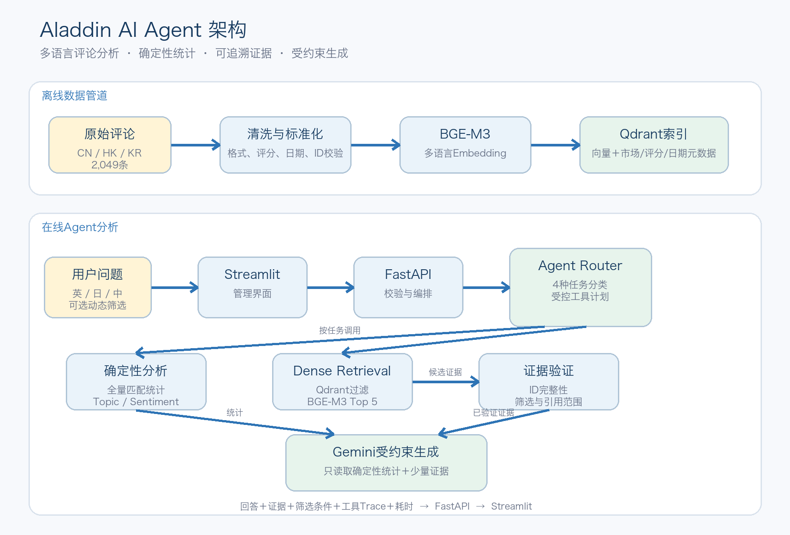

# Aladdin Agent：证据评论选择与“40条评论”说明

本文解释以下两个问题：

1. 页面中的“根拠となるカスタマーレビュー”（作为依据的客户评论）是根据什么列出的？
2. 项目明明有 2,049 条评论，为什么回答显示“レビュー総数 40 件”？

示例问题：

> 韓国と香港の来園者の主な不満を比較してください。  
> 请比较韩国和香港游客的主要不满。

---

## 一、作为依据的客户评论是如何选出的？

这些评论不是由 Gemini 随意挑选的，而是 Agent、筛选规则、BGE-M3 和 Qdrant 共同选出的。

### 1. Agent 判断任务类型

系统首先理解问题的意图：

```text
问题：比较韩国和香港游客的主要不满
任务：market_comparison
市场：KR、HK
意图：投诉／不满分析
默认评分范围：1～3星
```

因为问题包含“比较”，Agent 选择市场比较任务；因为问题询问“不满”，系统默认将分析范围限制为 1～3 星评论。

### 2. Qdrant 先执行硬条件筛选

在计算语义相关性之前，系统先排除不符合条件的评论：

```text
只保留市场为 KR 或 HK 的评论
只保留评分为 1～3 星的评论
如果用户选择日期，则只保留相应日期范围
```

因此，中国大陆、4～5 星以及日期范围之外的评论不会进入当前候选集合。

### 3. BGE-M3 将问题转换为向量

BGE-M3 是一个多语言 Embedding 模型。它会把日语问题转换成向量：

```text
日语问题
→ BGE-M3
→ 问题向量
```

所有评论在建立索引时也已经转换成评论向量。

### 4. Dense Retrieval 计算语义相关性

系统在符合筛选条件的评论中，比较问题向量与评论向量的相似程度。

这不是简单的关键词匹配。例如，评论可能没有写“不满”，但写了：

> 人が多すぎて、待ち時間が長かった。  
> 人太多，等待时间很长。

BGE-M3仍然可以判断它与“不满、拥挤、等待时间”等含义相关。

### 5. 市场比较时分别检索

市场比较任务不会把两个市场混在一起竞争全部证据名额，而是分别检索：

```text
香港评论 → 选择最相关评论
韩国评论 → 选择最相关评论
```

随后系统交替排列两个市场的结果，避免评论数量较多或相似度整体较高的市场完全占据证据列表。

如果用户要求显示 10 条证据，系统通常会尽量从香港和韩国各选取约 5 条；如果显示 5 条，则可能是一个市场 3 条、另一个市场 2 条。

### 6. Evidence Verifier 检查证据

进入回答生成前，系统检查：

- 评论是否有真实 `review_id`；
- 证据ID是否完整；
- 评论是否符合市场、评分和日期筛选；
- 最终回答引用的ID是否属于返回的证据集合。

### 7. Gemini 根据统计与证据组织回答

Gemini不会重新阅读全部2,049条评论，也不负责决定检索结果。它收到的是：

```text
程序计算的全量匹配统计
+ Topic分析结果
+ 少量高相关评论原文
```

Gemini负责把这些工具输出组织成可读的分析，并引用评论ID。

完整过程是：

```text
用户问题
→ Agent判断任务和筛选条件
→ Qdrant执行市场／评分／日期过滤
→ BGE-M3计算语义相关性
→ 分市场选择高相关评论
→ Evidence Verifier检查
→ Gemini根据统计和证据生成回答
```

因此，“作为依据的客户评论”表示：

> 在当前市场、评分和日期范围内，与问题语义最相关，并经过系统筛选检查的真实评论样本。

它们是解释统计结果的定性证据，并不意味着仅凭这几条评论就可以代表全部游客。

---

## 二、为什么评论总数只有40条？

40条不是项目的全部评论数，也不是系统只成功检索了40条，而是应用当前问题的市场和评分条件后，完整匹配的数据量。

### 1. 完整数据集

```text
全部评论：2,049条
├── 中国大陆（CN）：1,175条
├── 香港（HK）：440条
└── 韩国（KR）：434条
```

### 2. 只保留韩国和香港

问题只比较韩国和香港，因此中国大陆的1,175条评论被排除：

```text
香港：440条
韩国：434条
合计：874条
```

### 3. “不满”触发1～3星默认范围

系统将“不满、投诉、差评、改善原因”等问题默认解释为低评分分析，并设置：

```text
max_rating = 3
```

874条韩国和香港评论中，只有40条为1～3星：

```text
香港1～3星：23条
韩国1～3星：17条
合计：40条
```

所以回答中的统计为：

```text
レビュー総数：40件
香港：23件
韓国：17件
平均評価：2.5
```

这些数字由程序直接遍历全部匹配数据后计算，不是Gemini估算出来的。

### 4. 40条与10条证据的区别

```text
2,049条：项目完整数据集
874条：韩国和香港的全部评分评论
40条：韩国和香港的1～3星匹配评论
10条：从40条中选出的高相关原文证据
```

系统对全部40条计算评论数量、平均评分、市场分布和Topic比例；随后只把其中最相关的10条原文交给Gemini，用于说明具体问题和提供可检查的引用。

这是一种“全量定量分析＋少量定性证据”的设计：

```text
40条完整匹配数据
├── 用于确定性统计和Topic分布
└── Dense Retrieval选出10条
    └── 用于Gemini总结和原文引用
```

### 5. 为什么低评分评论比例较低？

Trip.com/Ctrip.com数据中的整体评分较高。韩国和香港的874条评论中，大多数为4～5星，所以1～3星评论只有40条。

这也意味着分析时需要注意：

- 40条是当前数据中的完整低评分样本；
- 但样本规模较小，结论应限定在当前数据来源和时间范围内；
- 不应推广为所有东京迪士尼游客的普遍结论；
- 管理建议应结合高评分评论、运营数据和更多数据源继续验证。

### 6. 如何查看韩国和香港的全部874条评论？

可以将问题改成：

> 韓国と香港の来園者の全体的なフィードバックを比較してください。  
> 请比较韩国和香港游客的整体反馈。

由于问题不再限定“不满”，系统不会自动设置1～3星范围。

也可以在UI中明确选择1～5星。用户显式选择的筛选条件优先于Agent自动推断。

---

## 三、Qdrant在这里有什么作用？

Qdrant是本项目的“评论向量数据库和检索引擎”。它主要解决的问题是：

> 用户提出自由问题后，如何从2,049条评论中快速找到语义最相关的几条？

整体位置如下：

```text
评论原文
→ BGE-M3生成评论向量
→ Qdrant保存向量和评论元数据

用户问题
→ BGE-M3生成问题向量
→ Qdrant执行条件筛选和向量相似度搜索
→ 返回5～10条高相关评论
→ Gemini根据证据生成回答
```

### 1. Qdrant保存什么？

每条评论在Qdrant中大致包含：

```text
review_id：评论唯一ID
region：CN／HK／KR
rating：1～5星
review_date：评论日期
text：评论原文
dense_vector：BGE-M3生成的语义向量
sparse_vector：用于实验性Sparse／Hybrid检索的词项向量
```

其中，向量是一组数字，用来表示评论的语义。

### 2. Qdrant先执行元数据筛选

对于“比较韩国和香港游客的主要不满”，Qdrant先应用：

```text
region in [KR, HK]
rating <= 3
date在用户指定范围内
```

不符合市场、评分或日期条件的评论不会进入语义排序。

这保证筛选是在检索阶段完成，而不是Gemini生成回答后再过滤。

### 3. Qdrant执行向量相似度搜索

BGE-M3把用户问题转换成问题向量，Qdrant将它与候选评论向量进行比较，返回语义最接近的评论。

它不是只寻找相同关键词。例如：

```text
问题：游客对排队有什么不满？
评论：等了两个小时，队伍几乎没有移动。
```

即使评论中没有“不满”或“排队”这些完全相同的词，向量检索仍可能识别它们语义相关。

BGE-M3支持多语言，因此日语问题也可以检索中文、韩文或英文评论。

### 4. 市场比较时Qdrant分别搜索

在市场比较任务中，系统分别调用Qdrant：

```text
香港筛选条件 → Qdrant检索香港高相关评论
韩国筛选条件 → Qdrant检索韩国高相关评论
→ 两个市场结果交替排列
```

这样可以防止一个市场占据全部证据名额。

### 5. Qdrant不负责什么？

Qdrant不负责：

- 判断Agent任务类型；
- 决定投诉问题默认使用1～3星；
- 给评论生成Topic标签；
- 翻译评论；
- 生成管理建议；
- 撰写最终自然语言回答。

各组件职责如下：

| 组件 | 主要职责 |
|---|---|
| Agent Router | 判断任务类型并推断默认筛选条件 |
| BGE-M3 | 把问题和评论转换成向量 |
| Qdrant | 保存向量、执行元数据过滤和语义检索 |
| Python统计工具 | 遍历完整匹配集合并计算数量、均值和分布 |
| TopicService | 基于预计算标签统计Topic和Sentiment |
| Gemini | 根据统计与证据生成总结和候选建议 |
| Streamlit | 展示问题、工具轨迹、统计、回答和原文证据 |

Qdrant也不直接“计算出40条”这个最终统计结论。代码通过Qdrant的过滤与`scroll`接口读取全部匹配记录，再由Python确定性计算数量、平均评分和市场分布。

一句话理解：

> BGE-M3负责把文字变成可以比较的数字，Qdrant负责保存这些数字、应用筛选条件，并找出最接近用户问题的评论。

---

## 四、“経営・管理上の対応策（提案）”是如何生成的？

“経営・管理上の対応策（提案）”不是从评论中直接复制的一段原文，而是Gemini基于统计和评论证据生成的候选管理建议。

生成过程是：

```text
确定性统计
+ Topic分析
+ 检索出的评论证据
+ 用户提出的业务问题
→ 受约束的Gemini推理
→ 候选管理行动
```

### 1. 程序先提供事实

在调用Gemini之前，程序已经计算：

- 完整匹配评论数量；
- 各市场评论数量；
- 平均评分及市场平均评分；
- 评分分布；
- Topic出现次数和占比；
- 不同市场的Topic差异。

这些数值来自程序计算，Gemini不能自行估算或修改。

### 2. 检索系统提供具体客户案例

Qdrant和BGE-M3提供少量高相关评论，包括：

- 评论ID；
- 市场；
- 星级；
- 日期；
- 评论原文。

这些评论用于说明游客具体遇到了什么问题，并为定性结论提供可展开、可检查的证据。

### 3. Gemini将问题转化为候选行动

Gemini可能进行如下推理：

```text
统计与证据：
waiting_time Topic占比较高，多条评论提到等待时间过长。

受约束推理：
等待体验是值得管理层优先调查的问题。

候选建议：
改善等待时间信息展示、客流引导或排队沟通。
```

另一个例子：

```text
统计与证据：
某市场较多提到员工沟通、语言说明或设施便利性。

受约束推理：
该市场可能存在服务沟通或信息可达性问题。

候选建议：
检查多语言指引、员工沟通培训和便利设施说明。
```

### 4. 客户证据、分析结论和管理建议必须分开

```text
客户证据：
“等待时间太长。”

分析结论：
等待时间是当前低评分评论中反复出现的问题之一。

管理建议：
管理层可以评估实时等待信息和客流分流措施。
```

第一项是客户原话；第二项是基于统计与证据的总结；第三项是AI提出的候选行动。

因此页面使用“提案”一词，而不是声称这些措施是客户直接要求或已经验证有效的方案。

### 5. Gemini受到哪些约束？

当前Prompt要求Gemini：

- 只能使用传入的确定性统计和评论证据；
- 不得编造数量、百分比、平均值、日期或市场差异；
- 定性结论必须引用真实`review_id`；
- 必须区分客户证据与管理建议；
- 不能把少量证据推广为全部游客的结论；
- 证据不足时必须说明限制；
- 回答最后必须说明证据范围。

系统还会检查回答引用的评论ID是否属于返回的证据集合。

### 6. 管理建议的可信度边界

这个Agent没有获得以下企业内部信息：

- 改善措施成本；
- 员工及设备容量；
- 实时客流；
- 改造周期；
- 法务与安全约束；
- 投资回报率；
- 措施实施后的因果效果。

因此它能提供的是：

> 根据当前评论数据，管理层值得进一步调查的问题，以及可能采取的行动方向。

它不能直接证明：

> 某项措施一定有效，或应该立即投资实施。

正确的决策流程应当是：

```text
评论证据和统计
→ AI生成候选行动
→ 管理人员审核
→ 结合成本、可行性和内部运营数据
→ 决定是否试点和实施
→ 使用新数据评估效果
```

一句话理解：

> “経営・管理上の対応策（提案）”是有证据约束的AI建议层，不是客户原话、事实统计或已经验证有效的经营决策。

---

## 五、面试时的简短回答

可以这样向面试官解释：

> 项目共有2,049条评论。这个问题只比较韩国和香港，并且“不满”意图会默认限制到1～3星，所以完整匹配样本是40条，其中香港23条、韩国17条。统计与Topic分布使用全部40条确定性计算；系统再通过BGE-M3 Dense Retrieval，从两个市场分别选择合计10条最相关评论作为可展开、可引用的定性证据。Gemini只根据这些统计和证据生成回答，不负责估算数量，也不会每次读取全部2,049条评论。

英文表达：

> The project contains 2,049 reviews in total. This question targets Korean and Hong Kong visitors and is classified as complaint analysis, so the Agent defaults to one-to-three-star reviews. That leaves 40 complete matching records: 23 from Hong Kong and 17 from Korea. Deterministic code calculates statistics and topic distributions over all 40 records, while BGE-M3 Dense Retrieval selects 10 balanced, high-relevance reviews as qualitative evidence. Gemini receives only those aggregates and evidence; it does not estimate the counts or reread all 2,049 reviews for every question.

Qdrant的面试表达：

> Qdrant是项目的向量数据库和检索层。它保存BGE-M3评论向量及市场、评分、日期等元数据，先执行筛选，再返回与问题语义最相关的评论作为Gemini的证据。

英文表达：

> Qdrant is the vector database and retrieval layer. It stores BGE-M3 review embeddings together with market, rating, and date metadata, applies filters before retrieval, and returns the semantically most relevant reviews as grounded evidence for Gemini.

管理建议的面试表达：

> 管理建议不是客户原话，也不是已验证的经营决策。Gemini只能根据程序计算的统计、Topic分布和检索证据提出候选行动，并且必须把客户事实与AI建议分开。最终仍需要管理人员结合成本、可行性和内部运营数据进行审核。

英文表达：

> The management actions are neither direct customer statements nor validated business decisions. Gemini proposes candidate actions only from deterministic statistics, topic distributions, and retrieved evidence, while explicitly separating customer facts from AI recommendations. A manager must still review feasibility, cost, and internal operational data before implementation.

---

## 六、今日进度总结（2026-08-25）

今天完成了受控演示环境、Agent评估、引用验证修复和项目文档更新，项目已经基本具备“可投递、可面试、可现场演示”的完整形态。

### 1. 受控演示环境验证

- Docker Compose成功构建并启动；
- FastAPI状态为`Healthy`，Streamlit UI正常运行；
- Cloudflare Tunnel可以从外部网络和手机访问；
- 演示密码验证成功；
- 已具备一键启动和关闭能力。

```bash
make demo-up
make demo-down
```

### 2. Agent评估结果

建立了40个英文、日文和中文评估问题，覆盖：

- 4种Agent任务分类；
- 市场自动识别；
- 投诉及低评分意图；
- 用户显式筛选条件优先；
- 工具调用计划；
- 无证据处理；
- 确定性统计和引用约束。

正式验证结果：

| 评估类型 | 结果 | 验证范围 |
|---|---:|---|
| 结构评估 | **40/40通过** | 任务路由、市场推断、筛选条件和工具计划，不调用Gemini |
| Docker Live冒烟测试 | **5/5通过** | API、检索、确定性统计、Gemini生成和引用范围 |

结构评估证明Agent的确定性决策逻辑正确；Live测试证明真实请求可以端到端经过API、检索、统计、Gemini生成和引用检查。5/5被准确表述为冒烟测试，不等同于完整Live 40/40。

### 3. 修复容器内评估命令

直接运行脚本曾出现：

```text
ModuleNotFoundError: No module named 'app'
```

原因是直接执行`scripts/run_agent_evaluation.py`时，Python没有稳定地将项目根目录加入模块搜索路径。现在统一使用模块方式运行：

```bash
docker compose exec api python -m scripts.run_agent_evaluation
```

Live评估命令为：

```bash
docker compose exec api python -m scripts.run_agent_evaluation \
  --live \
  --base-url http://127.0.0.1:8000
```

### 4. 修复引用评估误判

第一次完整Live运行显示13/40通过。失败明细高度集中于：

```text
answer cites IDs outside returned evidence
```

调查发现，大部分不是Agent引用了错误评论，而是旧评估器把组合引用：

```text
[ID1, ID2]
```

整体当成一个不存在的ID。

现在已经完成以下修复：

- 支持一个方括号中出现多个真实评论ID；
- 忽略`[1-3 stars]`等普通方括号说明；
- 仍能识别真正伪造的数字或十六进制评论ID；
- Prompt要求Gemini将每个评论ID分别放入独立方括号；
- 增加引用解析自动测试，测试结果为3/3通过；
- 修复后Docker Live冒烟测试达到5/5。

### 5. README与Git历史

英文和日文README已加入：

- Docker Compose结构评估及Live评估命令；
- 结构评估40/40的结果；
- Live冒烟测试5/5的结果；
- 对两种评估范围的清晰区分。

今天新增的主要Git提交：

```text
3cb1265 Document reproducible Docker Agent evaluation
a9094fa Harden generated citation validation
32834da Report validated Agent evaluation results
```

### 6. 当前项目状态

项目目前已经具备：

- 可复现的Docker Compose运行环境；
- 可临时公开的Cloudflare Tunnel；
- 演示密码、API Token、请求限流和Gemini费用保护；
- 英日双语管理界面；
- 多语言自由问题输入和动态筛选；
- 可审计的Agent工具执行轨迹；
- 确定性统计、Topic分析和原文证据；
- 人工标注的检索评估；
- 40题多语言Agent结构评估；
- 真实Docker Live端到端冒烟测试；
- 日英双语README、架构说明、案例说明和演示动图。

下一步不需要继续无限增加功能。更有价值的是保持演示稳定、准备面试讲解，并在需要时逐步扩大Live评估覆盖范围。

---

## 七、产品说明

### 1. 一句话定位

Aladdin是一个面向管理决策的多语言客户评论分析助手。它让管理者对2,049条东京迪士尼真实购票用户评论提出自由问题、使用动态筛选，并检查每项结论背后的原始评论证据。

### 2. 它解决什么问题？

传统仪表盘只能回答预先设计的问题；普通聊天机器人虽然灵活，却可能给出没有数据依据的总结。Aladdin把二者结合：既允许自由提问，又通过确定性统计、向量检索、原文引用和工具轨迹保持答案可检查。

目标用户包括：

- 客户体验与运营管理人员；
- 市场研究和消费者洞察团队；
- 需要比较不同客源市场反馈的区域负责人；
- 需要快速发现投诉原因和改善方向的管理人员。

### 3. 核心功能

- 支持英文、日文和中文自由问题；
- 支持CN、HK、KR市场以及评分、日期动态筛选；
- 自动路由到证据问答、根因分析、市场比较或改善规划；
- 对完整匹配数据计算数量、平均评分、Topic和Sentiment分布；
- 使用BGE-M3和Qdrant检索语义最相关评论；
- 通过Evidence Verifier检查证据和引用范围；
- 使用Gemini把统计与少量证据组织成可读分析；
- 展示原文、英文翻译、评论ID、市场、星级和日期；
- 展示Agent工具执行轨迹和耗时；
- Gemini故障时仍保留确定性统计与检索证据。

### 4. 数据与结果边界

当前数据包含中国大陆1,175条、香港440条、韩国434条，共2,049条Trip.com/Ctrip.com真实购票用户评论。由于数据来源、时间范围和市场范围有限，系统结论只代表当前数据集，不能直接推广为东京迪士尼全部游客的普遍意见。

管理建议属于AI根据当前证据提出的候选行动。真正实施前仍需管理者结合成本、运营能力、安全、法务和内部数据审核。

---

## 八、AI Agent架构图



### 架构阅读方法

离线阶段负责把评论变成可复用的数据资产：清洗评论、生成BGE-M3向量、建立Qdrant索引，并保存Topic标签。在线阶段只处理当前问题：Agent Router选择任务和工具，确定性代码计算统计，Qdrant检索少量证据，Evidence Verifier检查证据，最后Gemini根据受控输入生成回答。

这一设计的关键边界是：

- Gemini不在每次提问时读取全部2,049条评论；
- 全量数字由程序计算，不由Gemini估算；
- Qdrant负责过滤和检索，不负责生成结论；
- Agent的工具计划是有限且可审计的；
- 回答、证据、筛选条件和执行耗时一起返回前端。

---

## 九、面试参考答案集

### 问题1：这个项目与普通RAG有什么区别？

参考答案：

> 普通RAG通常是“检索几段文本，然后让大模型回答”。这个项目在此基础上增加了Agent任务路由、动态筛选、全量确定性统计、Topic分析、证据验证和可审计工具轨迹。不同业务问题会触发不同工具计划；数量、均值和市场分布由Python计算，Gemini只负责基于统计和少量证据组织自然语言回答。因此它更接近一个受控的评论分析Agent，而不仅是向量搜索加聊天界面。

面试重点：不要只强调“用了Agent”这个名称，要说明Agent具体决定了任务、筛选条件和工具顺序。

### 问题2：为什么不让Gemini每次读取全部2,049条评论？

参考答案：

> 全量读取会增加Token成本、响应时间和上下文噪声，而且数字仍可能被模型算错。项目把工作拆开：程序对完整匹配集合计算确定性统计；BGE-M3和Qdrant只选取5～10条与问题最相关的原文作为定性证据；Gemini接收统计与证据后生成总结。这样同时控制成本、延迟和幻觉风险。

### 问题3：系统如何防止幻觉？

参考答案：

> 我没有假设能够完全消除幻觉，而是建立多层约束。第一，Prompt要求只能使用传入的统计和证据；第二，数字由确定性代码生成；第三，Evidence Verifier检查评论ID、筛选范围和证据完整性；第四，评估器检查回答中的引用是否属于返回证据；第五，无证据时跳过生成；第六，Gemini故障时返回降级状态并保留证据。系统的目标是让错误更少、更容易发现和追溯。

### 问题4：为什么选择Dense Retrieval，而不是Hybrid或Reranker？

参考答案：

> 我没有凭经验直接决定，而是建立了人工相关性评估。15个问题产生241个Query／Review标注，比较Dense、Hybrid RRF和Reranker。Reranker 20在Top 10的nDCG略高，但本机CPU延迟约6.16秒；Dense的Recall@10与它几乎相同，nDCG@10为0.792，同时延迟明显更低。在实际UI只展示约5条证据的条件下，Dense的Top 5质量最好，因此选择Dense作为在线默认，把Hybrid和Reranker保留为离线实验方案。

### 问题5：40个Agent评估问题是如何设计的？

参考答案：

> 评估集不是随机问40句话，而是覆盖系统契约：英日中三种语言、4种任务分类、市场自动识别、投诉意图触发低评分、用户显式筛选优先、工具调用顺序、确定性统计、证据引用、无证据处理和Provider故障。结构评估不调用Gemini，结果为40/40；此外还做了Docker Live 5/5冒烟测试，验证API、检索、统计、Gemini生成和引用检查可以端到端工作。

### 问题6：第一次Live评估为什么只有13/40？

参考答案：

> 失败分析显示大部分集中在“引用ID不属于返回证据”。进一步检查发现，Gemini有时把两个合法ID写在同一组方括号中，例如`[ID1, ID2]`，旧评估器把整个字符串当成一个ID，因此产生误判。我修改了解析器，使其支持组合引用、忽略普通方括号说明，同时仍检测真正伪造的ID，并增加自动测试。修复后Live冒烟测试达到5/5。这个过程体现了评估系统本身也需要测试和校准。

### 问题7：如果数据扩大到10万条评论，架构需要怎么变化？

参考答案：

> 核心RAG流程不需要推倒重来，但基础设施要升级。首先把本地嵌入式Qdrant改为独立Qdrant Server或托管向量数据库，支持并发和持久化；数据摄取改成增量任务与队列；统计与Topic聚合预计算并缓存；API和Streamlit分离部署；限流和预算状态迁移到Redis或API Gateway；增加监控、重试、备份和数据版本。检索评估也需要扩大问题覆盖，并按市场、语言和时间切片观察质量。

### 问题8：如果正式上线，还缺少什么？

参考答案：

> 当前版本适合本地演示和作品集，不等同于生产系统。正式上线需要持久身份认证、角色权限、多租户隔离、共享限流和预算、独立Qdrant服务、自动数据摄取、监控告警、审计日志、备份恢复、隐私合规和SLA。同时需要更大的任务评估集、持续回归测试以及对管理建议进行人工审批。

### 问题9：为什么说管理建议不是事实？

参考答案：

> 评论原文是客户证据，统计结果是程序计算的事实，管理建议则是Gemini基于这些输入提出的候选行动。系统不知道预算、人员、设备容量、安全约束和ROI，因此不能证明某项措施一定有效。产品明确把“客户证据、分析结论和管理建议”分开，最终决策仍由管理人员结合内部运营数据完成。

### 问题10：这个项目最能体现Applied AI Engineer能力的地方是什么？

参考答案：

> 重点不是调用了某个模型，而是完成了从业务问题到可验证产品的完整闭环：数据清洗和索引、检索方案选择、人工相关性评估、Agent工具设计、确定性统计、引用约束、故障降级、结构化日志、Docker化、受控外网演示和日英双语产品文档。我能够解释每个技术选择的质量、延迟、成本和可靠性权衡。

### 30秒项目介绍

> Aladdin是一个多语言东京迪士尼评论分析Agent，处理2,049条来自中国大陆、香港和韩国的真实购票用户评论。管理者可以用英文、日文或中文自由提问，Agent会自动选择证据问答、根因分析、市场比较或改善规划任务。程序负责全量统计，BGE-M3和Qdrant负责筛选与语义检索，Gemini只根据统计和少量可引用证据生成回答。我还用241个人工相关性标签比较检索方案，并用40个多语言案例验证Agent结构逻辑。

### 2分钟回答结构

面试时可以按以下顺序回答：

1. 先说业务问题：自由分析和证据可信度必须同时满足；
2. 再说产品：三语提问、动态筛选、4种Agent任务和可展开证据；
3. 解释架构：确定性统计、BGE-M3、Qdrant、Evidence Verifier、Gemini；
4. 给出评估证据：241个人工标签、Dense默认方案、40/40结构评估和5/5 Live冒烟测试；
5. 最后主动说明限制和生产化路线。
